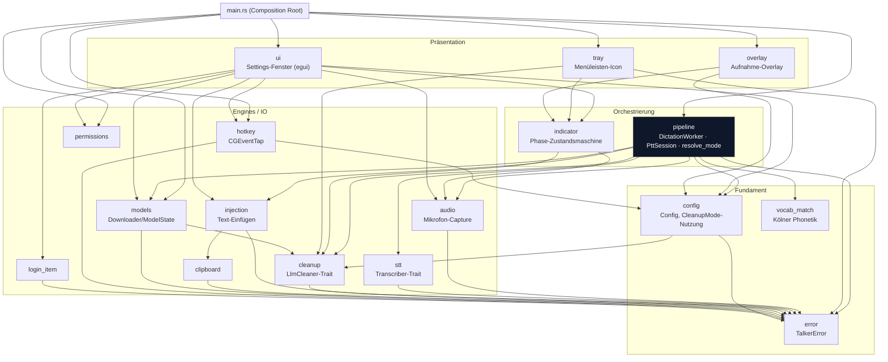
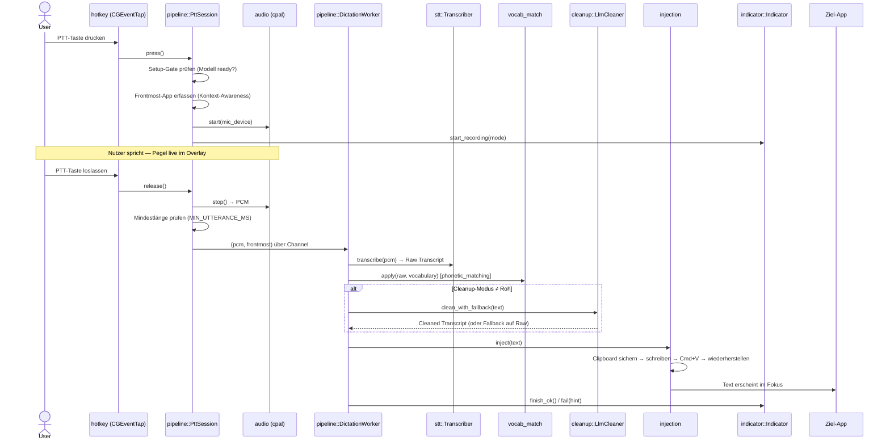
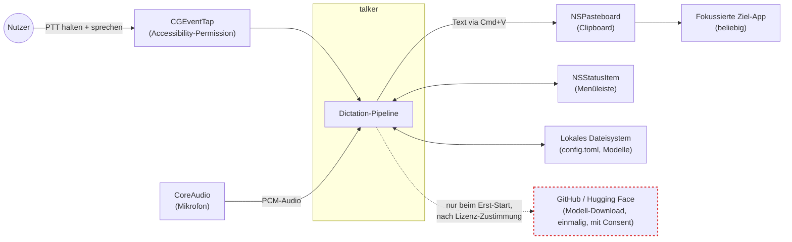

# Architektur-Überblick — talker

Leichtgewichtige Architektur-Doku statt vollem arc42 (Begründung: [ADR-0004](../adr/adr-0004-doku-format-ears-und-adr-diagramme.md)).
Entscheidungen stehen in [`docs/adr/`](../adr/), Begriffe in [`CONTEXT.md`](../../CONTEXT.md) —
hier nur, wie die Teile zusammenhängen: Bausteine, Laufzeit, Kontext.

## Bausteinsicht

Module nach Abhängigkeitsrichtung geschichtet — Pfeile zeigen "hängt ab von".
`main.rs` ist der Composition Root und verdrahtet alles; kein anderes Modul
kennt `main.rs`.

`pipeline` ist das mit Abstand am meisten abhängige Modul (deep module) —
`DictationWorker` (STT+Cleanup-Lifecycle) und `PttSession` (Press/Release)
bündeln die Domänenlogik hinter einem kleinen Interface; `main.rs` bleibt
Verdrahtung. `error` und `config` sind das Fundament — von fast jedem Modul
direkt oder indirekt referenziert.

## Laufzeitsicht — eine Utterance (CONTEXT.md)

Batch-Modell (v1): Text wird komplett erst nach dem Loslassen der PTT-Taste
eingefügt.

Tray und Overlay lesen `Indicator` unabhängig auf zwei Uhren (60-fps-Timer
bzw. egui-Repaint) — kein Teil dieses Sequenzflusses, siehe Code-Kommentare
in `tray.rs`/`overlay.rs` für die Idempotenz-Details.

## Kontextsicht — talker gegenüber macOS und der Außenwelt

Kein laufender Netzwerk-Egress außer dem einmaligen, zustimmungspflichtigen
Modell-Download — Audio und Transkripte verlassen den Rechner nie
(Nachweis: [`docs/security-audit.md`](../security-audit.md)). STT
(`ParakeetTranscriber`) und Cleanup (`GemmaCleaner`) laufen beide in-process,
kein Server, kein Daemon (ADR-0001, ADR-0003).
